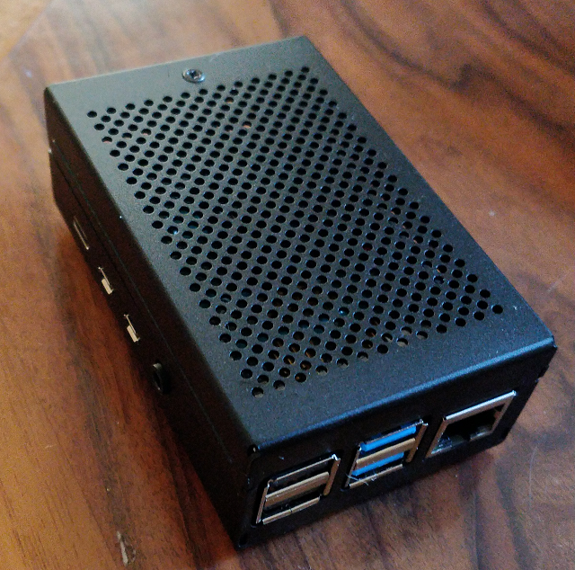
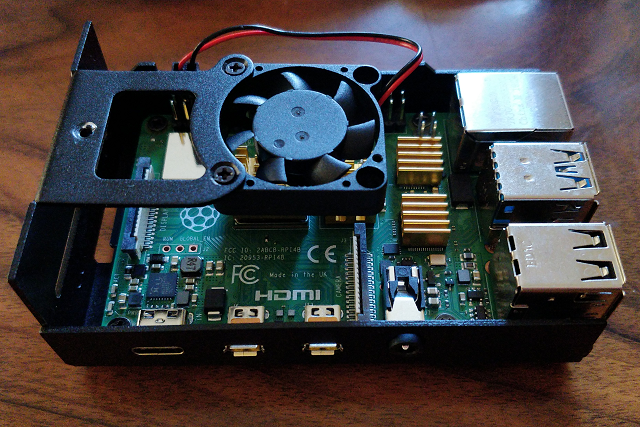
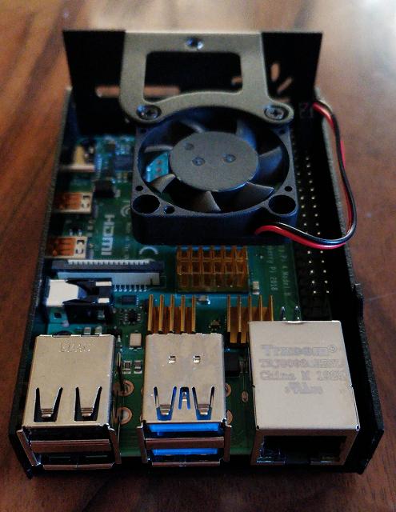
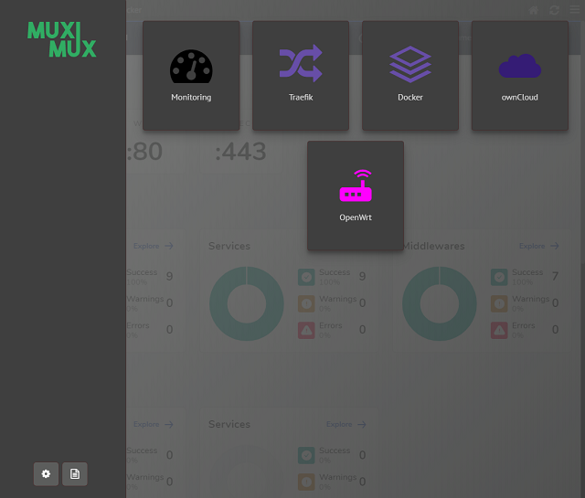

# Raspberry Pi based on Ubuntu - install script w/ smb, docker, watchtower, traefik, portainer, glances, certs-extraction, muximux, owncloud

## Requirements
* Micro-SD Card 16Go or more
* Ubuntu image [ubuntu-18.04.4-preinstalled-server-arm64+raspi3.img.xz](http://cdimage.ubuntu.com/releases/18.04.4/release/ubuntu-18.04.4-preinstalled-server-arm64+raspi3.img.xz)
* Clone the image to SD Card with [Rufus](https://sourceforge.net/projects/rufus.mirror/files/latest/download)
* Your favorite terminal, [PuTTY](https://www.chiark.greenend.org.uk/~sgtatham/putty/latest.html) or [MobaXterm](https://mobaxterm.mobatek.net/download.html)
* `Add hostname` or static lease on your router `to target RPi IP address` (and the `Local domain: local`) (for local reverse-proxy setup):
  * media.rpi.local
  * monit.rpi.local
  * proxy.rpi.local
  * docker.rpi.local
* On your main router, `open firewall tcp ports` 80, 443 forward to target your RPi IP address

### My RPi hardware setup
* [Raspberry Pi 4 Modèle B 4 Go ARM-Cortex-A72](https://www.amazon.fr/gp/product/B07TC2BK1X)
* [Sandisk 32 Go Carte microSD Extreme](https://www.amazon.fr/gp/product/B06XWMQ81P)
* [ZkeeShop Boitier en Aluminium avec Ventilateur et 4 dissipateur Thermique](https://www.amazon.fr/gp/product/B07YS8WHXT)
* [ESSAGER Câble USB de Type C](https://www.amazon.fr/gp/product/B07R66DDCM)
* [UGREEN Quick Charge 3.0 Chargeur Secteur USB Rapide 18W 3A QC 3.0](https://www.amazon.fr/gp/product/B07H4NCJ6L)
* [CSL - Câble Ethernet plat 0,5m - RJ45 Cat 6](https://www.amazon.fr/gp/product/B014FBKY0K)





## Install steps
1. Write SD card with the preinstalled image w/ Rufus, and power on the RPi

2. Add 'media' user, password and hostname

Default password: ubuntu
```bash
$ ssh ubuntu@ubuntu
$ sudo -i
# Change default root password
$ passwd
# Add new 'media' user
$ useradd -m -d /home/media -s /bin/bash -c "RPi's media user" -g users media
$ usermod -a -G adm,dialout,cdrom,floppy,sudo,audio,dip,video,plugdev,lxd,netdev,www-data,syslog media
$ usermod -g 100 media
# Set 'media' user password
$ passwd media
# Change host name from ubuntu to rpi
$ echo "rpi" > /etc/hostname
$ reboot
```

3. Remove default user and prepare directories

```bash
$ ssh media@rpi
$ sudo -i
$ deluser ubuntu
$ rm -Rf /home/ubuntu
$ mkdir /var/docker
$ chown media:users /var/docker
$ exit
$ ln -sf /var/docker $HOME/docker
```

4. Launch RPi installation

Setup is located on $HOME/`.env`
* `TZ`: timezone name (like Etc/UTC or Europe/Paris)
* `DOMAIN`: sub.example.com the domain name dns resolution
* `ACME_COPY`: 1 to enable copy acme certificates to your router (used on $HOME/docker-nas/docker-compose.yml > certs-extraction)
* `MAIL_ADR`: email address (username@gmail.com)
* `MAIL_PWD`: email password

Samba users list:
* `USER`: < User Login>|< User Password <i>(can be empty)</i>>|< Full Name User / Description>|< User mail>

```bash
$ ssh media@rpi
$ git clone https://github.com/joweisberg/rpi-docker-owncloud.git
$ cp -pR rpi-docker-owncloud/* .
$ sudo $HOME/os-install.sh 2>&1 | tee /var/log/os-install.log
```

5. Launch setup backup <u>(can be use after a complete setup)</u>

Data to backup are located on $HOME/`os-backup.conf`
```bash
$ ssh media@rpi
$ sudo $HOME/os-backup.sh
```

6. Setup docker / onwcloud

Edit and adapt to your needs: $HOME/`docker-nas/.env`
* `DOMAIN`: sub.example.com the domain name dns resolution
* `LE_MAIL`: Letsencrypt email address

```bash
$ ssh media@rpi
$ cd $HOME/docker-nas && ./docker-build.sh
```

7. RPi web access:

* http://media.rpi.local/ - RPi console management

* https://sub.example.com/owncloud (default login/password: admin/owncloud)

